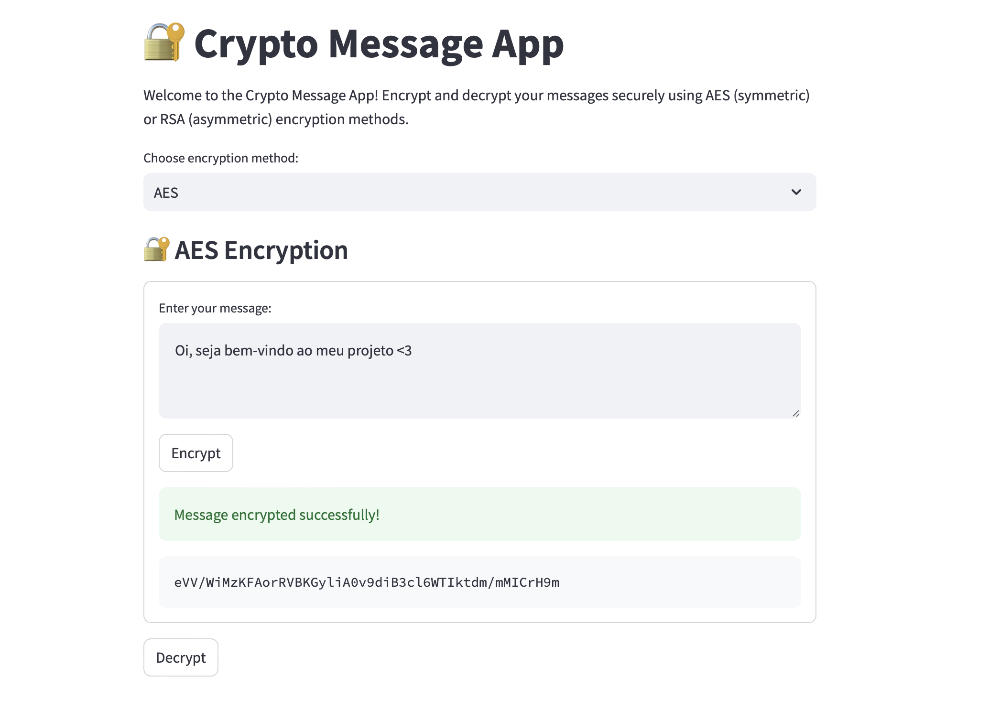

# 🔐 Crypto Message App



> “Encrypt or not to encrypt... there is no try.” – inspired by Master Yoda 🧙‍♂️✨

This is a simple and interactive Streamlit app that allows you to encrypt and decrypt messages using cryptographic algorithms like AES and RSA.

## 🚀 Features

- ✉️ Encrypt and decrypt messages
- 🔐 Support for symmetric (AES) and asymmetric (RSA) encryption
- 🧪 Simple interface for learning and testing cryptography concepts
- 🛡️ Focus on data protection and privacy

## 🔍 How it works

This app lets you enter any message and encrypt or decrypt it using:

- **AES (Advanced Encryption Standard)** – a symmetric encryption algorithm. You use the same key to encrypt and decrypt.
- **RSA (Rivest–Shamir–Adleman)** – an asymmetric encryption algorithm. You encrypt with a public key and decrypt with a private key.

It’s a hands-on way to understand how modern cryptography works in practice.

## 📦 Tech Stack

- Python 🐍
- Streamlit
- PyCryptodome (AES/RSA)
- Cryptography
- hashlib

## 📁 How to run

```bash
pip install -r requirements.txt
streamlit run app.py
```

## 🖼️ Screenshot

Here’s how the app looks when it’s running:


